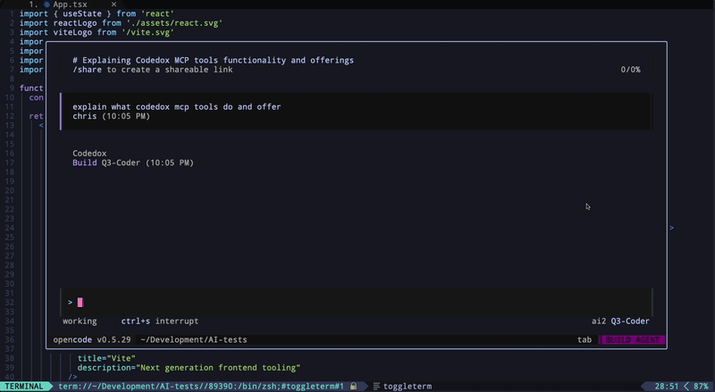
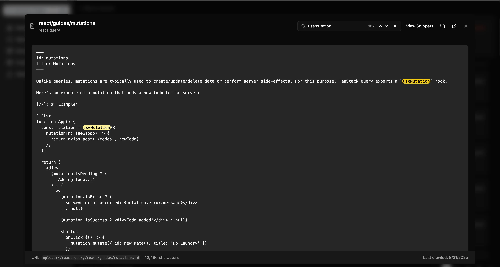

# CodeDox - AI-Powered Documentation Search & Code Extraction

**Transform any documentation site into a searchable code database** - CodeDox crawls documentation websites, intelligently extracts code snippets with context, and provides lightning-fast search via PostgreSQL full-text search and MCP (Model Context Protocol) integration for AI assistants.

## 📚 Documentation

For full documentation, installation guides, API reference, and more, visit:

### **[https://chriswritescode-dev.github.io/codedox/](https://chriswritescode-dev.github.io/codedox/)**

## Quick Start

### Docker Setup (Recommended)

```bash
# Clone the repository
git clone https://github.com/chriswritescode-dev/codedox.git
cd codedox

# Configure environment
cp .env.example .env
# Edit .env to add your CODE_LLM_API_KEY (optional for AI-enhanced extraction)

# Run the automated setup
./docker-setup.sh

# Access the web UI at http://localhost:5173
```

### Manual Installation

See the [full installation guide](https://chriswritescode-dev.github.io/codedox/getting-started/installation/) for detailed instructions.

## Key Features

- **Intelligent Web Crawling**: Depth-controlled crawling with URL pattern filtering and domain restrictions
- **Smart Code Extraction**: Dual-mode extraction (AI-enhanced snippet descriptions or standalone)
- **Lightning-Fast Search**: PostgreSQL full-text search with fuzzy matching
- **GitHub Repository Processing**: Clone and extract documentation from GitHub repositories with full path support (e.g., `/tree/main/docs`)
- **MCP Integration**: Native Model Context Protocol support for AI assistants
- **Modern Web Dashboard**: React + TypeScript UI for visual management
- **Version Support**: Track multiple versions of documentation
- **Real-time Monitoring**: Live crawl progress and health monitoring
- **Upload Support**: Upload documentation directly (Markdown, HTML, TXT) or from GitHub repositories

## Demo - MCP Integration Example - OpenCode TUI



## Screenshots

### Dashboard


### Markdown Search with Highlighting


### Source Detail View


## Documentation

- [Getting Started](https://chriswritescode-dev.github.io/codedox/getting-started/quickstart/)
- [Installation Guide](https://chriswritescode-dev.github.io/codedox/getting-started/installation/)
- [API Reference](https://chriswritescode-dev.github.io/codedox/api/rest/)
- [MCP Integration](https://chriswritescode-dev.github.io/codedox/features/mcp/)
- [Architecture Overview](https://chriswritescode-dev.github.io/codedox/development/architecture/)

## Contributing
  

See our [Contributing Guide](https://chriswritescode-dev.github.io/codedox/development/contributing/) for details on how to contribute to CodeDox.

## Author

**Chris Scott** - [chriswritescode.dev](https://chriswritescode.dev)

## License

This project is licensed under the MIT License - see the [LICENSE](LICENSE) file for details.
