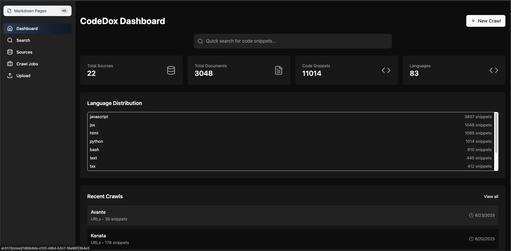
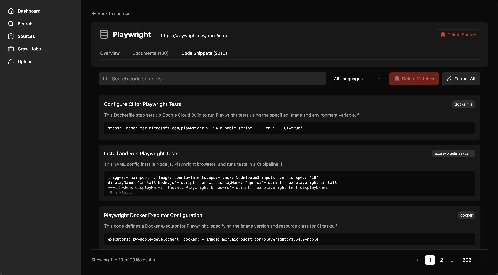
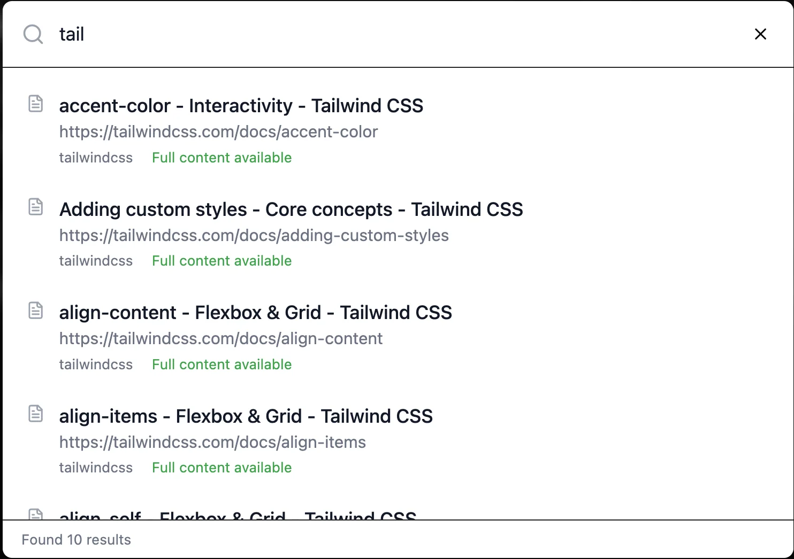
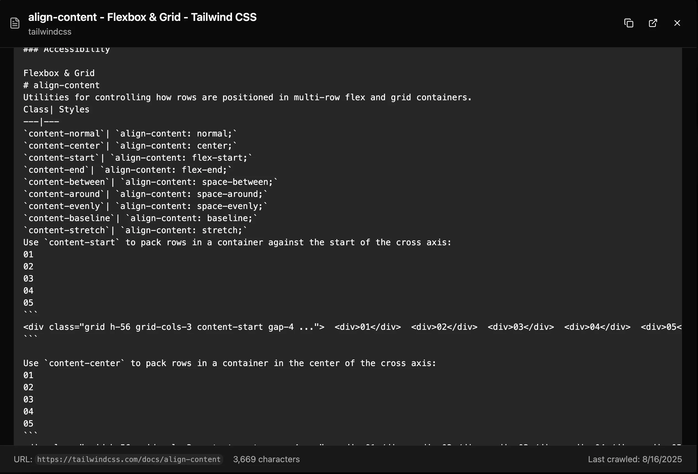

# CodeDox Documentation

## Overview
CodeDox is a code extraction and search system that crawls documentation websites, intelligently extracts code snippets, and provides them via MCP (Model Context Protocol) and a web UI.

## Quick Links
- [Installation](getting-started/installation.md)
- [Getting Started](getting-started/quickstart.md)
- [Web UI Guide](features/webui.md)
- [API Reference](api/rest.md)
- [MCP Tools](features/mcp.md)

## Features
- 🕷️ Smart documentation crawling with Crawl4AI
- 🤖 LLM-powered code extraction
- 🔍 PostgreSQL full-text search
- 🔌 MCP integration for AI assistants
- 🌐 FastAPI REST API & Web UI
- 📊 Real-time monitoring dashboard
- 🎨 Modern, responsive interface

## Screenshots

### Dashboard Overview

*Real-time statistics and system monitoring*

### Source Management

*Detailed source information and snippet browsing*

### Advanced Search

*Powerful search with fuzzy matching capabilities*

### Document Viewer

*Rich document viewing with syntax highlighting*

## Documentation Sections

### Getting Started
- [Installation Guide](getting-started/installation.md) - Set up CodeDox locally or with Docker
- [Quick Start](getting-started/quickstart.md) - Get running in minutes

### Features
- [Web UI](features/webui.md) - Interactive dashboard and search interface
- [Crawling](features/crawling.md) - Smart documentation crawling
- [Code Extraction](features/extraction.md) - LLM-powered extraction
- [Search](features/search.md) - Full-text and fuzzy search
- [MCP Integration](features/mcp.md) - AI assistant tools

### API & Development
- [REST API](api/rest.md) - Complete API reference
- [Architecture](development/architecture.md) - System design and components
- [Contributing](development/contributing.md) - Development guidelines

Visit the [GitHub Repository](https://github.com/chriswritescode-dev/codedox)