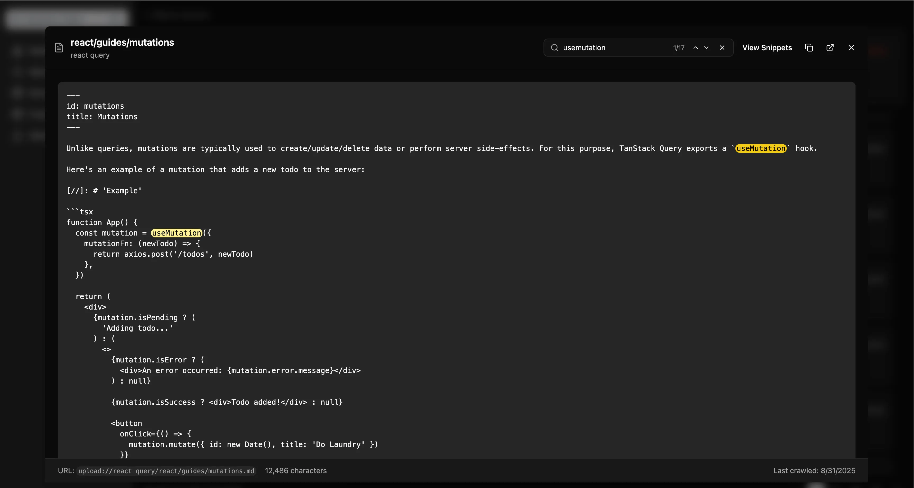

# Markdown Fallback Search

## Overview

The markdown fallback search feature enhances code snippet discovery by using documentation content as a secondary search mechanism when direct code searches return few results. Users can also explicitly request enhanced search to maximize results.


*The Web UI provides intelligent highlighting and auto-scrolling to search matches within markdown documentation*

## How It Works

### Automatic Mode (Default)
1. **Primary Search**: The system first searches code snippets directly using the query terms
2. **Fallback Trigger**: If fewer than 5 results are found, the system automatically searches markdown documentation
3. **Snippet Discovery**: All code snippets from matching documentation pages are returned, even if they don't directly match the search terms
4. **Result Ranking**: Direct matches are ranked higher than markdown-discovered snippets

### Enhanced Mode
Users can explicitly request enhanced search by setting `search_mode="enhanced"`:
- Always searches markdown documentation regardless of direct match count
- Maximizes the number of results by including all snippets from relevant documentation
- Useful when you want comprehensive coverage of a topic

## Benefits

- **Better Recall**: Finds relevant code even when terminology differs between query and code
- **Context-Based Discovery**: If documentation discusses a concept, all related code examples become discoverable
- **No Performance Impact**: Only triggers when needed (< 5 direct results)
- **Transparent**: Results indicate when snippets were found via markdown

## Configuration

The feature can be configured in your environment or config file:

```python
# Enable/disable markdown fallback (default: True)
SEARCH_MARKDOWN_FALLBACK_ENABLED=true

# Number of direct results that triggers fallback (default: 5)
SEARCH_MARKDOWN_FALLBACK_THRESHOLD=5

# Maximum documents to search via markdown (default: 10)
SEARCH_MARKDOWN_FALLBACK_DOC_LIMIT=10
```

## Example Usage

### Automatic Fallback
**Query**: "JWT authentication"

**Without markdown fallback**:
- Searches only snippet titles/descriptions
- Returns 0 results if no snippets mention "JWT authentication"

**With markdown fallback (automatic)**:
- Searches snippet titles/descriptions (0 results)
- Triggers fallback (< 5 results)
- Finds documentation pages discussing JWT authentication
- Returns all code snippets from those pages (e.g., `validateToken()`, `refreshAuth()`)
- User gets comprehensive examples even though snippets don't mention "JWT"

### Enhanced Mode
**Query**: `get_content("react", "hooks", search_mode="enhanced")`

**Result**:
- Searches snippet titles/descriptions (finds 15 direct matches)
- **Also** searches markdown documentation (even though we have 15 matches)
- Finds 10 documentation pages discussing hooks
- Returns 15 direct matches + 50 additional snippets from those pages
- Total: 65 results instead of just 15

## Result Format

Snippets discovered via markdown are marked in the output:

```
[Found via documentation search - relevance: 0.75]
TITLE: validateToken
DESCRIPTION: Validates authentication token
SOURCE: https://docs.example.com/auth
...
```

## API Usage

### MCP Tool
```python
# Default mode - automatic fallback
results = await tools.get_content(
    library_id="react",
    query="authentication"
)

# Enhanced mode - maximize results
results = await tools.get_content(
    library_id="react", 
    query="authentication",
    search_mode="enhanced"
)
```

### Direct Database API
```python
from src.database import CodeSearcher

# Default mode
results, total = searcher.search(
    query="authentication",
    job_id=library_id,
    search_mode="code"  # or omit for default
)

# Enhanced mode
results, total = searcher.search(
    query="authentication",
    job_id=library_id,
    search_mode="enhanced"  # Force markdown search
)
```

## Performance

- **Best case**: No overhead when direct search returns ≥ 5 results (default mode)
- **Worst case**: ~10-15ms additional latency when fallback triggers
- **Enhanced mode**: Additional 10-15ms for markdown search even with many direct matches
- **Indexed search**: Both snippet and markdown searches use GIN indexes for fast lookups