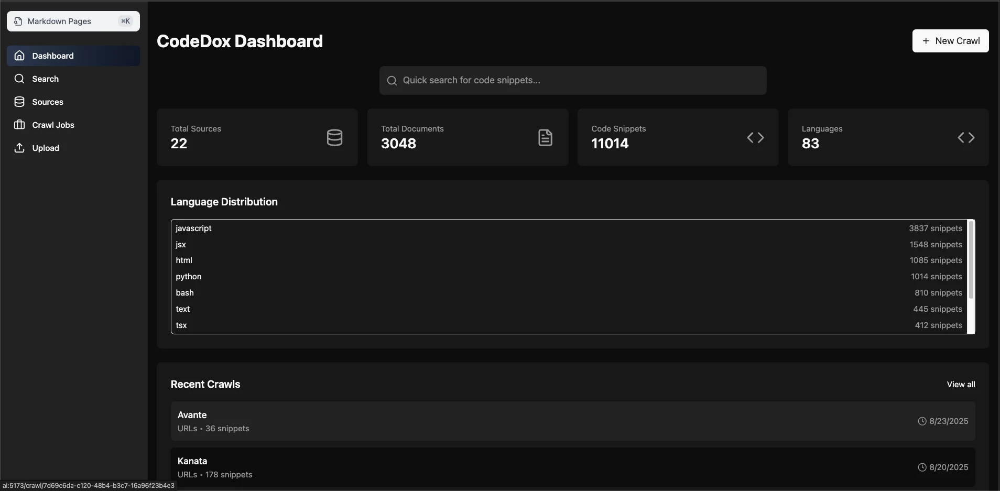
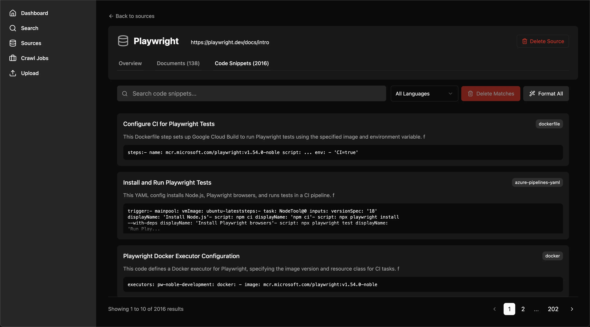
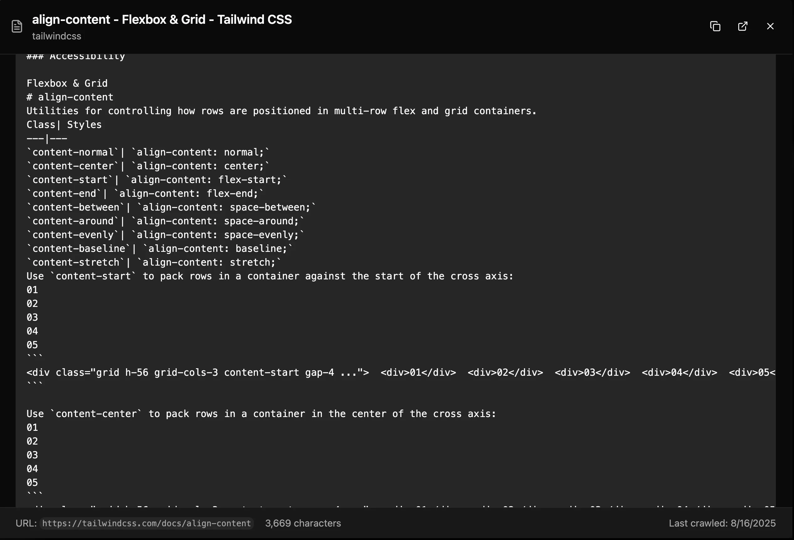

# Web UI

CodeDox includes a modern, responsive web interface for managing documentation sources, monitoring crawl jobs, and searching code snippets.

## Features

### Dashboard
The main dashboard provides a comprehensive overview of your CodeDox system:
- Real-time statistics for total sources, documents, and code snippets
- Recent crawl jobs with status indicators
- Quick access to all major features
- System health monitoring



### Source Management
Browse and manage all your documentation sources:
- View detailed information about each source
- Track snippet counts and crawl history
- Filter and search through sources
- One-click source deletion with confirmation



### Advanced Search
Powerful search capabilities with multiple options:
- Full-text search across all code snippets
- Filter by source, language, or metadata
- Fuzzy matching for approximate searches
- Real-time search results with syntax highlighting


### Document Viewer
Full content viewing with rich formatting:
- Markdown rendering with syntax highlighting
- Code block extraction and display
- Navigate through related documents
- Copy code snippets with one click



## Navigation

The Web UI is organized into several main sections:

1. **Dashboard** (`/`) - System overview and statistics
2. **Search** (`/search`) - Advanced code search interface
3. **Sources** (`/sources`) - Browse and manage documentation sources
4. **Crawl Jobs** (`/crawl`) - Monitor and manage crawl operations
5. **Upload** (`/upload`) - Upload markdown documentation files

## Key Features

### Real-time Updates
- WebSocket connections for live crawl progress
- Automatic refresh of statistics
- Live health monitoring for active crawls

### Responsive Design
- Mobile-friendly interface
- Dark mode support
- Accessible navigation
- Keyboard shortcuts for power users

### Data Management
- Bulk operations support
- Export capabilities for search results
- Import markdown documentation
- Version tracking for documentation updates

## Technical Stack

The Web UI is built with modern technologies:
- **React** - Component-based UI framework
- **TypeScript** - Type-safe development
- **Tailwind CSS** - Utility-first styling
- **Vite** - Fast build tooling
- **WebSocket** - Real-time communication

## Development

### Running the Web UI

```bash
# Start both API and Web UI (development mode)
python cli.py serve

# Access the Web UI
open http://localhost:5173
```

### Building for Production

```bash
cd frontend
npm run build

# The built files will be in frontend/dist
```

### Configuration

The Web UI connects to the API server via environment variables:
- `VITE_API_URL` - API server URL (default: `http://localhost:8000`)
- `VITE_WS_URL` - WebSocket URL (default: `ws://localhost:8000`)

## Best Practices

### Search Tips
- Use quotes for exact phrase matching
- Combine filters for precise results
- Leverage fuzzy search for typos
- Use language filters to narrow results

### Source Management
- Organize sources by project or technology
- Regular crawl updates for fresh content
- Monitor crawl health for issues
- Clean up outdated sources periodically

### Performance
- Limit search results for faster response
- Use pagination for large result sets
- Enable caching for frequently accessed data
- Monitor system resources during large crawls