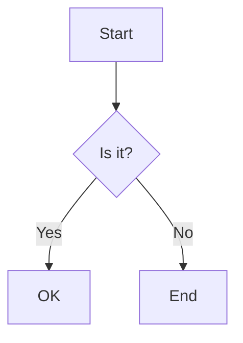

# Test Code Block Formats

This file contains various code block formats that should be extracted.

## Standard Markdown Fenced Code Blocks

### Basic Python
```python
def hello_world():
    print("Hello, World!")
    return 42
```

### JavaScript with trailing Copy button
```javascript
const greeting = (name) => {
    console.log(`Hello, ${name}!`);
};
```Copy

### Code with special characters
```bash
#!/bin/bash
echo "Testing special chars: < > & \" ' $ \\ "
VAR="test with   multiple   spaces"
```

### Empty language specification
```
plain text code block
with multiple lines
```

## Alternative Fence Characters

### Using tildes
~~~ruby
class Person
  def initialize(name)
    @name = name
  end
end
~~~

### Nested backticks
````markdown
Here's how to use code blocks:
```python
print("nested code")
```
````

## Code Blocks with Metadata

### With line highlighting
```python {highlight: [2, 4-6]}
def fibonacci(n):
    if n <= 1:  # This line is highlighted
        return n
    else:  # These lines
        return fibonacci(n-1) + fibonacci(n-2)  # are also
        # highlighted
```

### With title
```typescript title="src/utils/helper.ts"
export function debounce<T extends (...args: any[]) => any>(
  func: T,
  wait: number
): (...args: Parameters<T>) => void {
  let timeout: NodeJS.Timeout;
  return (...args: Parameters<T>) => {
    clearTimeout(timeout);
    timeout = setTimeout(() => func(...args), wait);
  };
}
```

### With multiple metadata
```jsx {1,3-4} showLineNumbers title="App.jsx"
function App() {
  const [count, setCount] = useState(0);
  return (
    <div>
      <button onClick={() => setCount(count + 1)}>
        Count: {count}
      </button>
    </div>
  );
}
```

## Indented Code Blocks

### Four-space indented
    def indented_code():
        # This is indented with 4 spaces
        return "Should be detected"

### Tab indented
	function tabIndented() {
		// This uses tabs
		return "tabs";
	}

## GitHub-specific formats

### Diff format
```diff
- const old = "red";
+ const new = "green";
  const unchanged = "gray";
```

### Mermaid diagrams (should be treated as code)


## Docusaurus/MDX formats

:::code-group

```python [Python]
def greet(name):
    return f"Hello, {name}!"
```

```javascript [JavaScript]
function greet(name) {
    return `Hello, ${name}!`;
}
```

:::

## Single-line code blocks

### Valid single-line code
```python
print("This is valid single-line code")
```

### Import statement
```javascript
import { useState, useEffect } from 'react';
```

## Edge cases

### Code with leading/trailing whitespace
```python

def has_empty_lines():
    """This function has empty lines above and below"""
    pass

```

### Mixed indentation (tabs and spaces)
```python
def mixed_indent():
	if True:  # This line uses a tab
        print("This uses spaces")  # This line uses spaces
	    print("Mixed!")  # This has tab + spaces
```

### Very long single line
```javascript
const longLine = "This is a very long line that might get wrapped in some editors but should still be preserved exactly as is without any modifications to the whitespace or line breaks even if it exceeds typical line length limits";
```

### Unicode and emojis in code
```python
def print_emoji():
    print("Hello 👋 World 🌍!")
    japanese = "こんにちは"
    return "🚀"
```

### Code that looks like prose
```text
This might look like prose because it contains words like the, this, and that.
However, it should still be extracted if it's in a code block.
Even if it ends with a period.
```

### Empty code block
```

```

### Only comments
```python
# This is just a comment
# Another comment line
# No actual code here
```

### HTML entities in code
```html
<div class="example">
    &lt;p&gt;This has HTML entities &amp; special chars&lt;/p&gt;
    <p>But this is actual HTML</p>
</div>
```